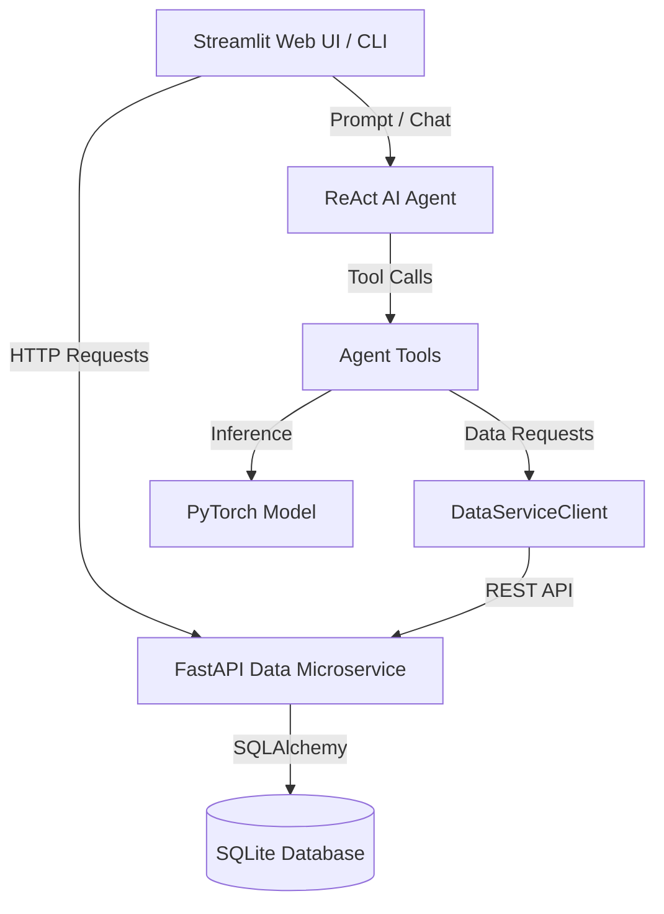

# Credit Risk Intelligence System (`credit-risk-agent`)

A hybrid credit risk assessment and automated underwriting system combining a PyTorch deep learning model for default probability prediction, a FastAPI Data Microservice for secure client data access, and a GigaChat ReAct AI Agent for intelligent credit scoring analysis.

---

## Key Features

- **ReAct AI Agent**: Conducts multi-step automated credit risk analysis using function calling and outputs structured underwriting reports.
- **FastAPI Data Microservice**: High-performance REST API service (`credit_risk_agent.services.data_service`) exposing client profiles, payment history, and calculated financial metrics.
- **HTTP Microservice Client (`DataServiceClient`)**: Decoupled, type-safe HTTP client utilizing `httpx` and `Pydantic v2` models for seamless communication between agent tools, web UI, and the data service.
- **Real-Time Event Streaming**: Real-time streaming of agent reasoning steps (`thought`), tool executions (`tool_call`), observations (`observation`), and final underwriting decisions (`final`).
- **Hybrid ML Model (`CreditDefaultPredictor`)**: PyTorch neural network processing 6-month historical payment sequences alongside static demographic features to estimate default probability.
- **Scenario Simulation & Stress Testing**: Custom scenario simulation tool (`simulate_custom_scenario`) allowing the agent to evaluate "what-if" financial conditions (e.g. credit limit adjustments or payment behavior changes).
- **Interactive Streamlit Dashboard**: Web interface for exploring client demographic metrics, payment trends, default risk scores, and engaging in live agent chat sessions.
- **CLI Suite**: Command-line interface for batch evaluation, single-prompt queries, interactive terminal chat mode, and client lookup.

---

## Tech Stack

- **Core**: Python 3.12+, Poetry
- **Microservice & API**: FastAPI, Uvicorn, HTTPX, Pydantic v2, SQLAlchemy
- **Machine Learning**: PyTorch, Scikit-Learn, Pandas, NumPy
- **LLM & Agent**: GigaChat API SDK, ReAct Pattern
- **Web UI**: Streamlit
- **Database**: SQLite3
- **Experiment Tracking**: MLflow
- **DevOps & Containerization**: Docker, Docker Compose
- **Quality & Testing**: Pytest (130+ unit & integration tests), Ruff, Mypy, Pre-commit

---

## Architecture Overview



---

## Installation & Setup

### 1. Prerequisites
- Python `>= 3.12`
- Poetry

### 2. Installation
```bash
git clone https://github.com/iraedeus/credit-risk-agent.git
cd credit-risk-agent
poetry install
```

### 3. Environment Configuration
Create a `.env` file from `.env.example`:
```bash
cp .env.example .env
```

Configure credentials in `.env`:
```ini
KAGGLE_USERNAME=your_kaggle_username
KAGGLE_KEY=your_kaggle_key
GIGACHAT_CREDENTIALS=your_gigachat_authorization_data
GIGACHAT_MODEL=GigaChat-2

DATA_SERVICE_URL=http://localhost
DATA_SERVICE_PORT=8000
```

---

## Data Pipeline & Model Training

### 1. Download & Prepare Dataset
Download the UCI Credit Card dataset from Kaggle and populate the SQLite database:
```bash
poetry run download-dataset
```

### 2. Train Model & Track Experiments
Train the `CreditDefaultPredictor` PyTorch model with customizable hyperparameters:
```bash
poetry run train-model --lr 0.001 --batch-size 32 --hidden 64
```

Evaluate model performance on the test split:
```bash
poetry run train-model --view-quality
```

Launch the **MLflow Dashboard** to inspect experiment runs, metrics, and model parameters:
```bash
poetry run mlflow ui
```
Open `http://localhost:5000` in your browser.

---

## Usage

### 1. Start FastAPI Data Microservice
Launch the Data Microservice API server:
```bash
poetry run uvicorn credit_risk_agent.services.data_service.main:app --reload --port 8000
```
API Healthcheck: `http://localhost:8000/api/v1/healthcheck`

### 2. Web Application (Streamlit)
```bash
poetry run streamlit run credit_risk_agent/app/main.py
```
Open `http://localhost:8501` to access:
- **Client Profile**: Financial metrics, utilization trends, and payment discipline.
- **AI Agent Chat**: Interactive chat interface with real-time reasoning visualization.

### 3. Command Line Interface (CLI)

List available test client IDs:
```bash
poetry run credit-risk-agent --list-clients
```

View financial info for a specific client:
```bash
poetry run credit-risk-agent --get-client-info -c 100
```

Run single prompt assessment:
```bash
poetry run credit-risk-agent --prompt "Evaluate credit risk for client 105" --verbose
```

Interactive terminal chat mode:
```bash
poetry run credit-risk-agent --chat --verbose
```

### 4. Docker Containerization

Run the application using Docker Compose:
```bash
docker compose up --build
```
Open `http://localhost:8502` to access the Streamlit UI.

Or build and run directly via Docker CLI:
```bash
docker build -t credit-risk-agent .
docker run -d -p 8501:8501 --env-file .env -v $(pwd)/data:/app/data -v $(pwd)/artifacts:/app/artifacts credit-risk-agent
```

---

## Testing & Quality

Run test suite:
```bash
poetry run pytest
```

Code linting and formatting:
```bash
poetry run ruff check .
```

Type checking:
```bash
poetry run mypy credit_risk_agent
```

Pre-commit validation:
```bash
poetry run pre-commit run --all-files
```

---

## Repository Structure

```
credit-risk-agent/
├── artifacts/              # Model weights (model.pt), scaler, and client splits
├── credit_risk_agent/      # Main package source code
│   ├── agent/              # ReAct Agent engine, GigaChat API integration, tools, events
│   │   └── tools/          # Agent function tools (metrics, model inference, simulation)
│   ├── app/                # Streamlit UI pages (app_pages) and CLI entrypoint
│   ├── data/               # Preprocessing pipelines, data loaders, and scaler
│   ├── model/              # PyTorch model definitions, dataset wrappers, predictor
│   ├── schemas/            # Pydantic schemas (agent, ML, domain enums)
│   ├── services/           # Microservices layer
│   │   └── data_service/   # FastAPI microservice (routers, repository, HTTP client)
│   └── config.py           # Paths, microservice settings, hyperparameter defaults
├── data/                   # SQLite database files (database.db, train/test split DBs)
├── docs/                   # Documentation and ER diagrams
├── notebooks/              # Data analysis and model exploration notebooks
├── scripts/                # Data download and training CLI scripts
├── tests/                  # Pytest unit and integration test suite
│   ├── integration/        # Microservice, training, agent integration tests
│   └── unit/               # Comprehensive unit tests (130+ tests)
├── Dockerfile              # Docker container definition
├── docker-compose.yml      # Docker Compose configuration
├── pyproject.toml          # Poetry dependencies and tool configurations
└── README.md               # Project documentation
```

---

## License

This project is licensed under the [MIT License](LICENSE).
